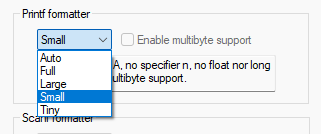

# Eprintf (ebucci printf)

Eprintf is an alternative formatted output functions intended to be used with embedded systems with **LIMITED RESOURCES**.

`eprintf` does not offer the support of all the format specifiers that original `printf` supports out of the box. Instead it provides 5 basic formats: `%s`, `%c`, `%i`, `%x`, `%b` and a convenient way of adding more even custom specifiers. 
It is also small, fast, thread-safe and completely static.

`Eprintf` is delivered as a single header-only STB-like library. In order to use it macro `EPRINTF_IMPLEMENTATION` must be defined in one (and only one) place of the project before `#include eprint.fh` statement.

To compare it with iar-provided implementation of printf an empty project was created. It contained only following code:

```c
//#define MY_PRINTF
#ifdef MY_PRINTF
#include "eprintf_core.h"
#else
#include <stdio.h>
#endif
char buf[100];
int z;
int main(void)
{
#ifdef MY_PRINTF
  esnprintf(buf, sizeof(buf), "%s %05i", "Hello", 69);
#else
  snprintf(buf, sizeof(buf), "%s %05i", "Hello", 69);
#endif
}
```
 Iar provides several implementations of printf: 


 
The most valuable of which is `Small`, as `Tiny` does not even support flags for padding and thus is pretty useless. And the other two are just too big. 

Below are some of the preliminary results that were obtained with a very ealy implementation of eprintf:

| Function     | Options   | Size, bytes |
|--------------|-----------|-------------|
| IAR snprintf | tiny      | 700         |
| IAR snprintf | small     | 1858        |
| esnprintf    | full      | 1964        |
| esnprintf    | S C I X B | 1530        |
| esnprintf    | S C I X   | 1434        |
| esnprintf    | S I       | 1164        |

Although not drastically but it still appers to be smaller than iar-provided one. Also, having custom format specifiers is swag.